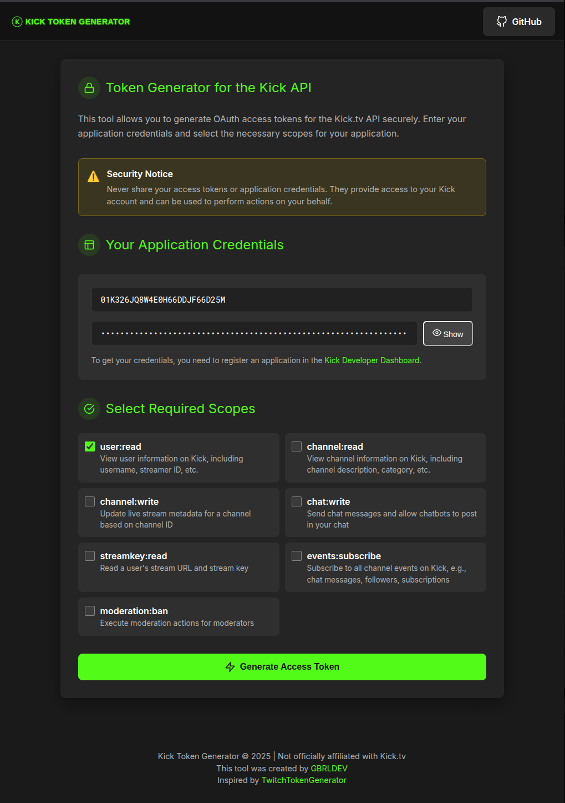

# Kick Token Generator

<div align="center">


[](https://opensource.org/licenses/MIT)
[](http://makeapullrequest.com)
[](https://github.com/seu-usuario/kick-token-generator/graphs/commit-activity)

</div>

## 📋 Overview

This project is a secure OAuth token generator for the Kick.tv API, similar to [TwitchTokenGenerator](https://twitchtokengenerator.com), but specifically designed for the Kick platform. The tool facilitates the development of applications and integrations with the Kick.tv platform by securely generating and managing access tokens efficiently.



## ✨ Features

- 🎨 Modern and user-friendly interface with Kick.tv theme
- 🔐 Secure OAuth token generation using PKCE (Proof Key for Code Exchange)
- 🔍 Custom scope selection for API access
- 🔄 Access token renewal using refresh tokens
- 📋 One-click token copy functionality
- 📱 Responsive design for mobile devices

## 🛠️ Technologies Used

- **Backend**: NestJS (Node.js)
- **Frontend**: HTML, CSS, and vanilla JavaScript
- **Authentication**: OAuth 2.0 with PKCE
- **Security**: Express-session for session management

## ⚙️ Prerequisites

- Node.js (v16.x or higher)
- npm or yarn
- A registered application on the Kick.tv developer platform

## 📥 Installation

1. Clone the repository:
   ```bash
   git clone https://github.com/gabrielcstr/kick-token-generator.git
   cd kick-token-generator
   ```

2. Install dependencies:
   ```bash
   npm install
   # or
   yarn install
   ```

3. Create a `.env` file in the project root with the following variables:
   ```
   PORT=3000
   SESSION_SECRET=your_secret_here
   KICK_CLIENT_ID=your_client_id_here
   KICK_CLIENT_SECRET=your_client_secret_here
   KICK_REDIRECT_URI=http://localhost:3000/auth/callback
   ```

4. Start the development server:
   ```bash
   npm run start:dev
   # or
   yarn start:dev
   ```

5. Access the application at `http://localhost:3000`

## 📚 Usage Guide

1. Access the homepage and select the scopes you want for your token
2. Click "Generate Access Token"
3. Log in to your Kick.tv account (if necessary)
4. Authorize the application to access your account
5. You'll be redirected back to the generator with your tokens

## 🔧 Development

### Project Structure

```
kick-token-generator/
├── client/              # Static frontend
│   ├── assets/          # Images and static resources
│   ├── index.html       # Home page
│   ├── callback.html    # Authentication callback page
│   ├── script.js        # Frontend JavaScript
│   └── style.css        # CSS styles
├── src/                 # Backend code
│   ├── auth/            # Authentication module
│   │   ├── auth.controller.ts
│   │   ├── auth.module.ts
│   │   └── auth.service.ts
│   ├── app.module.ts    # Main NestJS module
│   └── main.ts          # Application entry point
└── ...                  # Configuration files and dependencies
```

## 🤝 Contributing

Contributions are welcome! Feel free to open issues or submit pull requests.

1. Fork the project
2. Create a branch for your feature (`git checkout -b feature/new-functionality`)
3. Commit your changes (`git commit -m 'Add new functionality'`)
4. Push to the branch (`git push origin feature/new-functionality`)
5. Open a Pull Request

## 📝 License

This project is licensed under the [MIT License](LICENSE).

## ⚠️ Disclaimer

This project is not officially affiliated with Kick.tv. It is an independent tool created to assist developers.

## 👨‍💻 About the Developer

Hello! I'm Gabriel, a passionate full-stack developer dedicated to creating solutions that make other developers' lives easier. With experience in JavaScript/TypeScript ecosystems and specialization in APIs and authentication services, I'm always striving to develop useful tools for the community.

- 🌐 [Website](https://gbrldev.com)
- 📱 [LinkedIn](https://linkedin.com/in/gabriel-ferreira)
- 🐱 [GitHub](https://github.com/gabrielcstr)
- 📧 Email: [gabriel.developed@gmail.com](mailto:gabriel.developed@gmail.com)

## ☕ Support the Project

If you found this project useful and would like to support ongoing development and maintenance, consider buying me a coffee! Your contribution helps keep this project active and develop new features.

<div align="center">
  <a href="https://www.buymeacoffee.com/gabriel.dev" target="_blank">
    
  </a>
  <br>
  <a href="https://ko-fi.com/gabriel.dev" target="_blank">
    
  </a>
</div>

## 🙏 Credits

Inspired by [TwitchTokenGenerator](https://twitchtokengenerator.com) created by Nate Mielnik.
